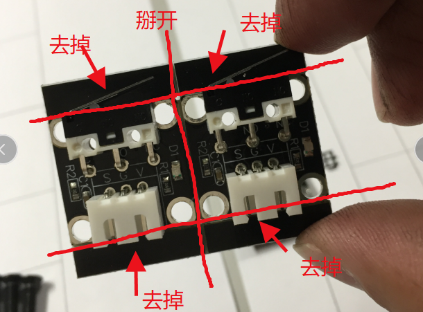
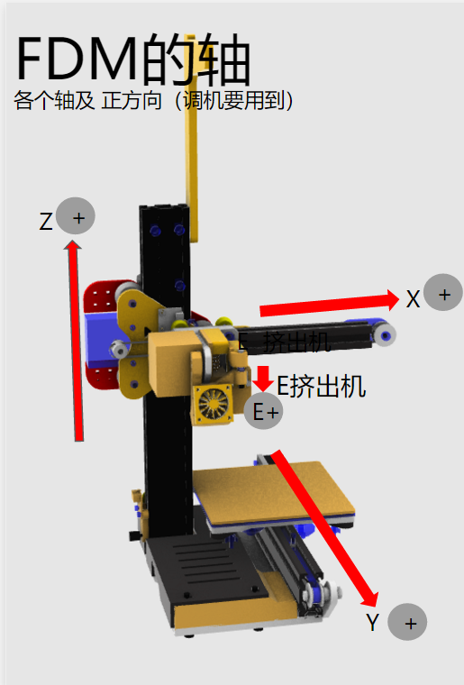
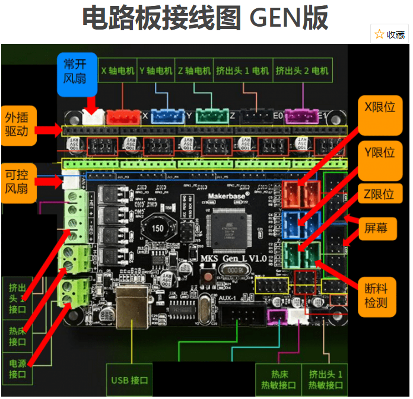
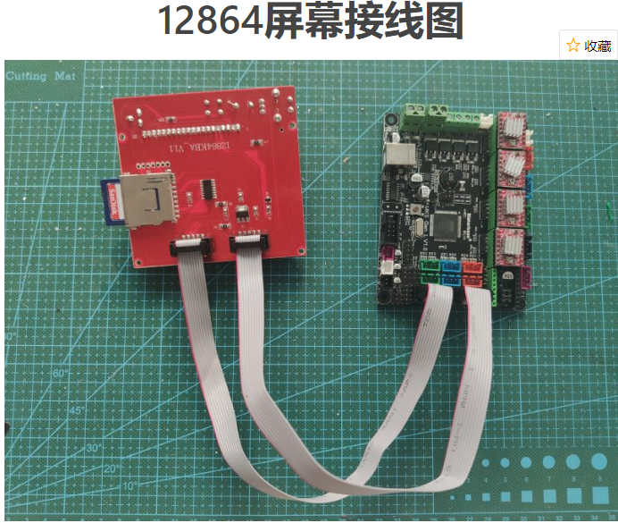

# 小树2代安装指南

## 新手先了解：

3D打印机（DIY）产品的客服时间是比一般产品周期长的，这个和买手机不是一回事，尤其是远程排错，大家的很多粗心错误给我们增加了很多判断时间，每个新手都是这么过来的，我们都非常理解，全部问题我们都给大家耐心解答，所以单个客户客服时间比一般产品长很多，这个不是我们服务不好，是因为我们服务好才出现的情况。我们工程师直接给大家客服，每天2次下午和晚上集中回复，我们的回复速度上不敢说行业最快，也算是最快之一了。如果是一般厂商，你的问题交给客服，客服去问工程师，来来回回2天起步，碰上疑难问题几个月解决不了都是有可能的。所以大家先了解一下这个行业情况，心平气和的来玩机，这样装机就会顺利很多！

另外，大家可能不是工程师，但是还是要养成一些好习惯，比如看文档和教学视频，很多问题都是由于大家不按文档操作造成的。

- 官网文档地址：[https://www.minitree.fun/?page_id=13746](https://www.minitree.fun/?page_id=13746)
- 教学视频地址：[小树B站视频](https://space.bilibili.com/53548293)
- 买耗材，配件 看这里：[群友整理的购买地址（基本都是最低价）](https://www.minitree.fun/?page_id=17137)

△ 预习视频：[小树预习——10分钟了解3D打印](https://www.bilibili.com/video/BV16z4y1Z7es)

---

## 安装顺序

### 1. 预先安装

#### 1.1 GEN 2.1 主板驱动和跳线安装

视频：[MKS GEN 2.1主板装驱动和跳线帽](https://www.bilibili.com/video/BV1DA411L7NB)

注意：GEN 1.0，2.0 的跳线帽都是插好的，用户不需要插，没有跳线帽包！

#### 1.2 热床安装（针对热床用户）

视频

- [开关电源安装视频](https://www.bilibili.com/video/BV1Wy4y1r7L6)
- [热床安装视频](https://www.bilibili.com/video/BV1zZ4y1H7Lz)

#### 1.3 X滑车安装

视频：[X滑车安装技巧](https://www.bilibili.com/video/BV1na4y1s75b)

（这个可以预习，也可以先装起来）

#### 1.4 热敏电阻绑紧加固

视频：[热敏电阻的更换](https://www.bilibili.com/video/BV1Dz4y1Z7a9)

#### 1.5 限位开关处理

### 2. 装机视频

- [小树2代装机视频（上）](https://www.bilibili.com/video/BV1Hp4y1e7SU)
- [小树2代装机视频（中）](https://www.bilibili.com/video/BV1u64y1F7EZ)
- [螺丝位置图](https://docs.qq.com/slide/DZm5wUEVHRGtwYmRP)

### 3. 给主板用arduino软件刷固件

- [主机刷固件](https://docs.qq.com/doc/DZlJteHd6VGFDb1Fo)

### 4. 调机视频

- [调机视频](https://www.bilibili.com/video/BV1354y117px)

### 5. 安装断料检测

- [断料开关安装视频](https://www.bilibili.com/video/BV1oh411X7en)
- [更改固件并刷机](https://docs.qq.com/doc/DZktuVmVGS0R4cVZq)

### 6. 打印测试方块

打好发群里给群友看一下，机器没调好不要一直打，伤机器！

### 7. 看 cura 切片教学视频

- [cura4.6安装及使用教程（上）](https://www.bilibili.com/video/BV1Fz4y1R7Rt)

注意自己打印速度不要超过40mm/s

### 8. 自己切片打印

- 免费模型下载网站：<https://www.thingiverse.com>
- [玻璃取模方法](https://www.bilibili.com/video/BV12f4y197xQ)

## 基本知识

